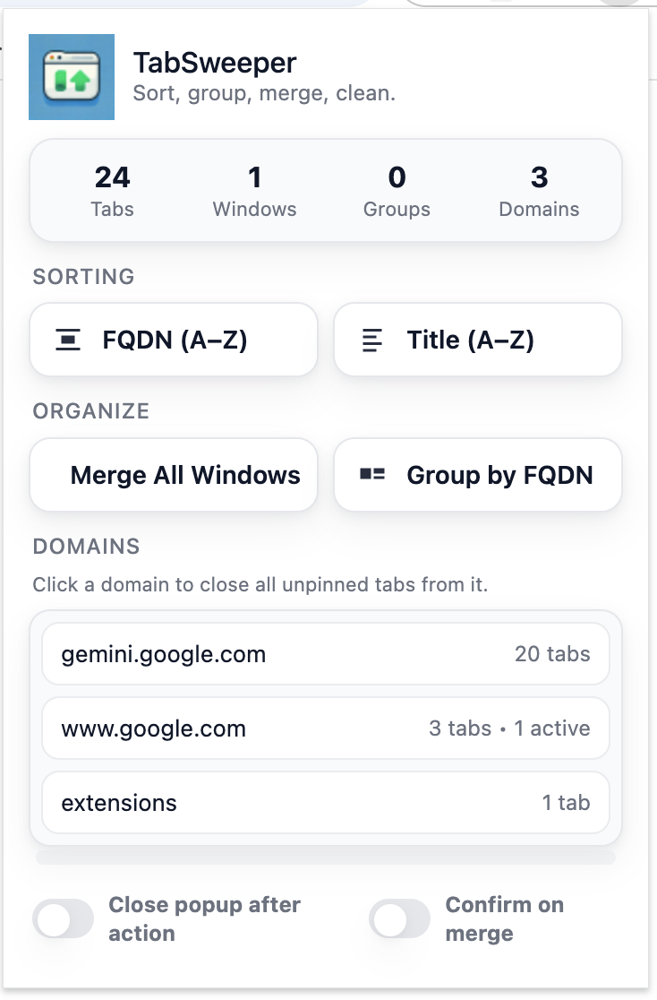

# TabSweeper

A Chrome extension that helps you sort, group, and manage your browser tabs.

## Features

- **Sort by FQDN (A-Z)** — Sort tabs alphabetically by domain name (stable sort preserves relative tab order within the same domain)
- **Sort by Title (A-Z)** — Sort tabs alphabetically by page title
- **Group by FQDN** — Automatically group tabs by domain into named tab groups (requires 2+ tabs per domain)
- **Merge All Windows** — Pull all tabs from every open Chrome window into the current one
- **Domain list** — See all open domains across all windows ranked by tab count; click a domain to close all unpinned, inactive tabs from it
- **Stats bar** — Live counts for tabs, windows, groups, and domains — reflects all open Chrome windows

## Options

| Option | Description |
|---|---|
| Close popup after action | Automatically closes the extension popup after any action |
| Confirm on merge | Shows a confirmation dialog before merging windows |

## Keyboard Shortcuts

| Key | Action |
|---|---|
| `F` | Sort by FQDN |
| `T` | Sort by Title |
| `G` | Group by FQDN |
| `M` | Merge all windows |

## Installation

1. Clone or download this repository
2. Open Chrome and go to `chrome://extensions/`
3. Enable **Developer mode** (top right toggle)
4. Click **Load unpacked** and select the repository folder

## Permissions

- `tabs` — Read and rearrange tabs
- `tabGroups` — Create and manage tab groups
- `storage` — Persist user preferences
- `contextMenus` — Context menu actions
- `notifications` — Status notifications
- `<all_urls>` — Read tab URLs for domain detection
